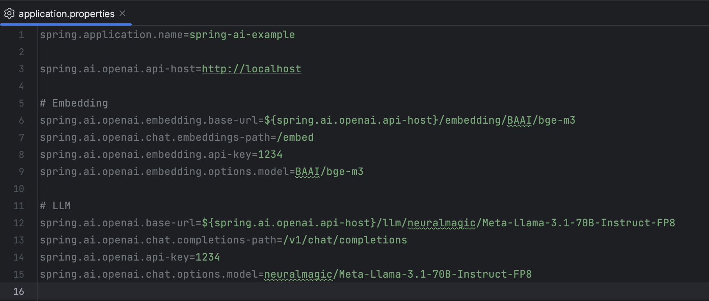
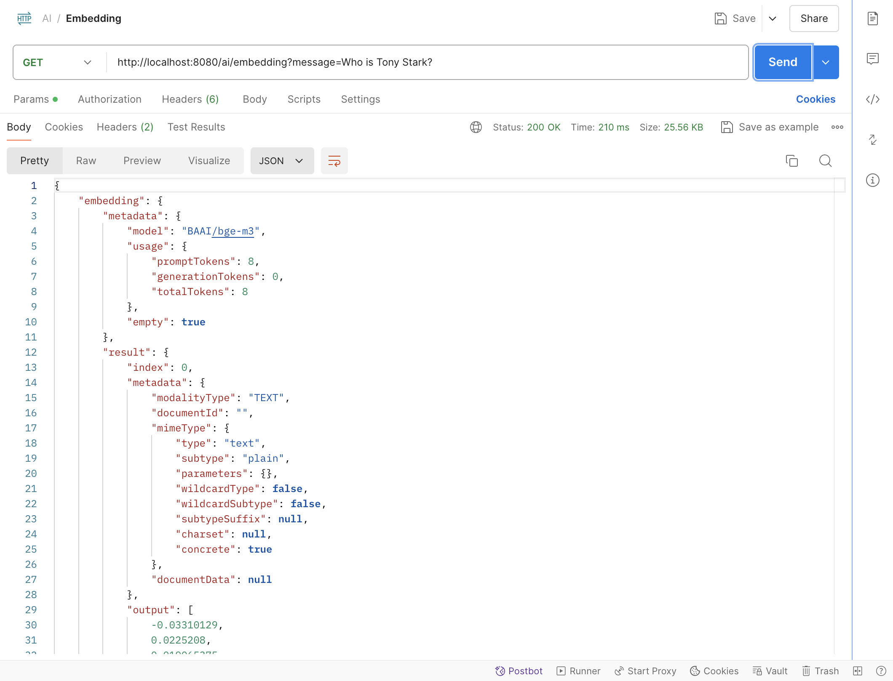
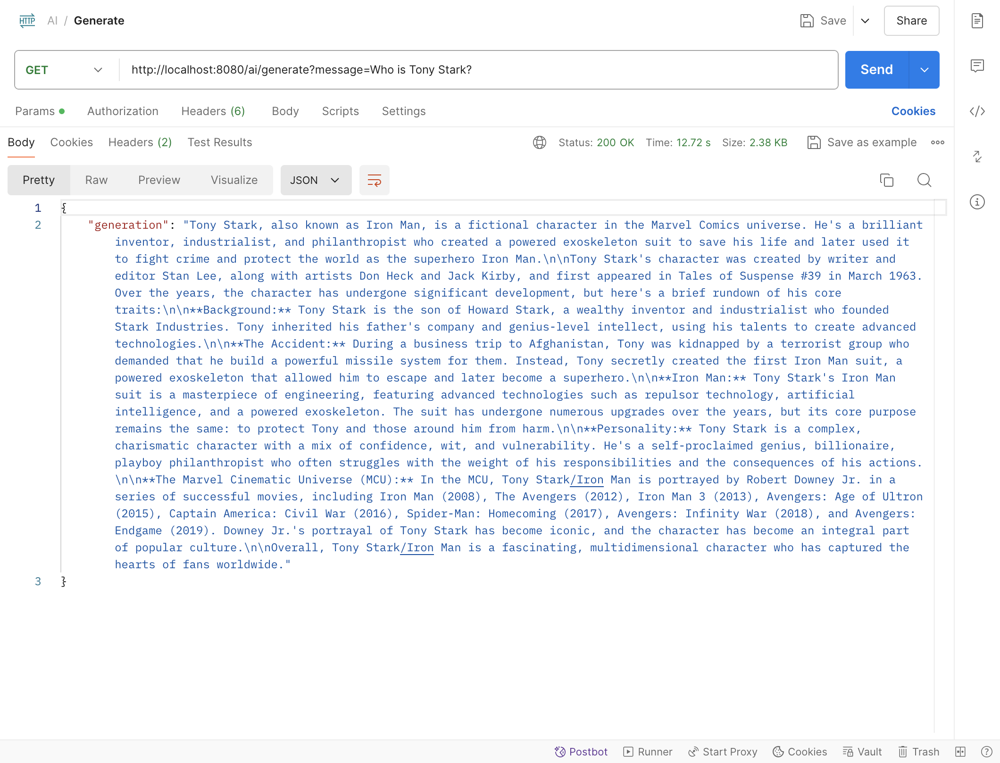
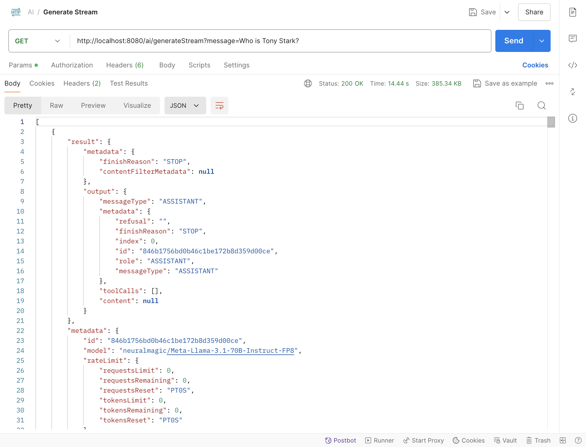

# Spring AI Example

> ตัวอย่างการเขียน Spring boot เพื่อเชื่อมต่อกับ LLM API

LLM API ที่ใช้เป็นตัวอย่างใน Repo นี้เป็น LLM API ที่ผม Host ขึ้นมาเองนะครับ
ถ้าอยากเปลี่ยนไปใช้ LLM API ที่อื่น ก็สามารถแก้ Config ในไฟล์ `application.properties` ได้เลย



Build project

```sh
mvn clean package
```

Run Project

```sh
mvn spring-boot:run
```

# Example

### Embedding

```sh
curl --location 'http://localhost:8080/ai/embedding?message=Who%20is%20Tony%20Stark%3F'
```



### Generate

```sh
curl --location 'http://localhost:8080/ai/generate?message=Who%20is%20Tony%20Stark%3F'
```



### Generate Stream

```sh
curl --location 'http://localhost:8080/ai/generateStream?message=Who%20is%20Tony%20Stark%3F'
```


